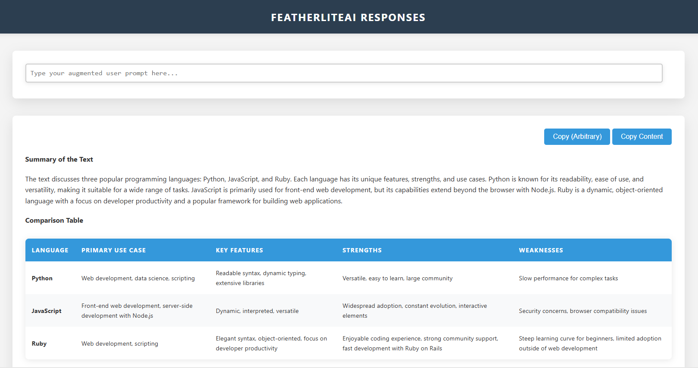

# FeatherLiteAI: Lightweight AI for Speed Demons
FeatherLiteAI is designed for those who prioritize speed and simplicity. Through HTML, I wanna deliver fast and efficient LLM responses.

## 🚀 Core Principles:

- Minimalism: We focus on core functionality and performance, aiming for a streamlined approach using only **HTML** and **Python**. (Calling for talent, please let me know if you have better ideas.)
- Speed: HTML's inherent speed ensures rapid response times, making FeatherLiteAI ideal for this simple task.
- Macro (Optional): Further use **macro** to make it more powerful.

## Getting Started with FeatherLiteAI:
1. ```pip install -r requirements.txt```
2. Setting up the ```config.json```. Please use your own API key.
3. Copy something to your clipboard.
4. Run the script (If you are using the Macro, I suggest running the **bat/bash** script, as it can automatically hide the **terminal**).
5. Done.
6. Optional: Make a RAM drive and put everything into it.

## ⚙️ Getting Started with Macro (Optional):

1. Install your chosen macro software: **Logitech Options+** is a great option, but feel free to explore other alternatives.
2. Create a macro: Within your macro software, create a new macro that executes your desired **bat/bash** scripts.
2. Assign a shortcut: Assign a keyboard shortcut to your macro for easy access. (e.g. Ctrl + Shift + Alt + 1)
3. Trigger your AI: With a single execution of your assigned shortcut, your Python script will run, leveraging FeatherLiteAI's capabilities.

## 🤝 Contributing to FeatherLiteAI:

My father taught me:``Son, if you don't learn to teamwork with the others, you will never be successful in your life.`` 
This is what I humbly believe in, and hold onto all the time.

I welcome contributions from all programmers who share the passion for building fast and efficient AI solutions. If you're interested in contributing to FeatherAI, please feel free to reach out to me! <br>
Email: kachunchan.a@gmail.com
